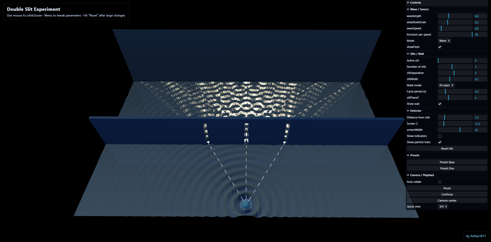
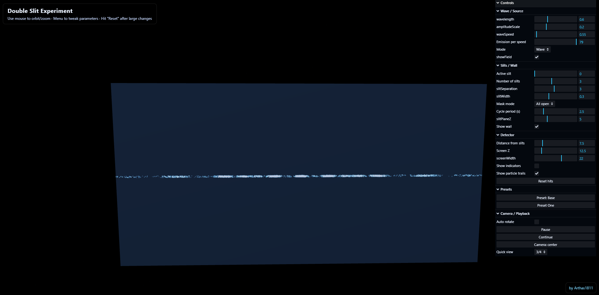

# Double Slit Experiment 3D Simulation

An interactive 3D visualization of the famous double slit experiment from quantum mechanics, built with Three.js. This simulation lets you explore how light and matter behave under different conditions, demonstrating the fundamentals of quantum mechanics in an intuitive way.

## Wave vs Particle Behavior

This simulation contrasts two scenarios:

- **Wave Mode**: Light or matter waves spread out and interfere. With two slits open, overlapping waves form an interference pattern of bright and dark bands on the detection screen.
- **Particle Mode**: Classical comparison. Particles travel in straight lines and pass through only one slit, producing a simple additive pattern without interference.

## Features

- Interactive 3D visualization with orbit/pan/zoom
- Single, double, or up to six slits; adjustable slit width and separation
- Configurable wavelength, observer distance, emission rate, wave speed
- Toggle field display, detector markers, particle trails
- Preset camera angles

## Screenshots

### Wave Interference Double Slit

*Classic double slit interference pattern with wave propagation*

### Interference Pattern

*Resulting interference pattern from a double slit setup*

### Triple Slit Waves

*Three-slit wave interference with richer fringe structure*

### Triple Slit Interference

*Detector intensity pattern from three slits*

### Single Slit Waves

*Diffraction pattern from a single slit*

### Single Slit Interference

*Single slit diffraction effects*

### Classical Particle Trajectories Double Slit

*Classical particles (like balls) traveling through the slits in straight lines*

## Getting Started

### Installation

#### Quick Start (easiest)
1. Download the repository as a ZIP and unzip it.
2. Open the unzipped folder and go to `Double-Slit-Sim/`.
3. Right-click `index.html` -> "Open with" -> your browser (Chrome/Firefox/Safari/Edge).

#### Developer Setup (build/server; includes git clone option)
Use this if you want to rebuild `bundle.js` or run a local server.

1. Clone the repo (alternative to ZIP):
   ```bash
   git clone https://github.com/Arthas1811/Heisenberg-Sim.git
   cd Heisenberg-Sim/Double-Slit-Sim
   ```
   If you downloaded the ZIP, open a terminal in the `Double-Slit-Sim` folder instead.
2. Install dependencies (requires Node.js and npm):
   ```bash
   npm install
   ```
3. Build the project (regenerate `bundle.js` after edits):
   ```bash
   npm run build
   ```
4. Start a local server (uses `http-server` from dev deps):
   ```bash
   npm start
   ```
5. Open your browser to `http://localhost:8080`.

## How to Use

### Basic Controls

**Mouse Controls:**
- Left click + drag: orbit the camera
- Scroll: zoom
- Right click + drag: pan

**Overlay Hint:** "Use mouse to orbit/zoom - Menu to tweak parameters - Hit 'Reset' after large changes"

### GUI Menu

Click the menu icon or press the GUI button to open controls:

#### Experiment Parameters
- **Wavelength**: change wavelength (affects fringe spacing)
- **Slit Separation**: distance between slits
- **Slit Width**: physical width of each slit
- **Slit Count**: 1 to 6 slits
- **Slit Mask Mode**: `All`, `Single`, or `Cycle`

#### Detection & Display
- **Mode**: `wave` or `particle`
- **Wave Speed**
- **Emission Rate**
- **Detector Offset**

#### Visualization Options
- **Show Field**, **Show Wall**, **Show Indicators**, **Show Trails**
- **Auto Rotate**
- **Paused/Resume**

#### Camera & Reset
- **View** presets (Three Quarter recommended)
- **Reset Detections**
- **Reset Camera**

### Tips for Best Results

1. Start with double slit in wave mode to see the classic pattern.
2. Toggle between wave and particle modes to compare behaviors.
3. After large changes, hit "Reset" to reinitialize.
4. Adjust detector offset to see how distance changes the pattern.
5. Use multiple camera angles to understand the 3D geometry.

### Experiment Ideas

1. Observe wave interference in wave mode.
2. Compare single vs double slit (diffraction vs interference).
3. Change wavelength to see fringe spacing shifts.
4. Change slit width to see its effect.
5. Use particle mode with low emission to watch detections accumulate.
6. Use "Cycle" slit mode to see sequential opening and closing.

## Technical Details

### Built With
- Three.js
- OrbitControls
- lil-gui
- ESBuild

### System Requirements
- Modern web browser with WebGL support
- Recommended: 2 GB RAM and a dedicated GPU for smooth animation

## Files Structure

```
Double-Slit-Sim/
  index.html           # Main HTML page
  main.js              # Core simulation logic
  bundle.js            # Bundled JavaScript (generated)
  style.css            # Styling and layout
  package.json         # Project dependencies
  vendor/
    three.min.js       # Three.js library (minified)
    three.module.js    # Three.js module version
    OrbitControls.js   # Camera control system
    lil-gui.esm.min.js # GUI library
```

## Interactive Learning

Ideal for:
- Physics students learning quantum mechanics and wave-particle duality
- Understanding the double slit experiment at a visceral level
- Exploring observation effects on quantum systems
- Visualizing interference and diffraction

## Browser Compatibility

- Chrome/Chromium (recommended)
- Firefox
- Safari
- Edge

## License

ISC

## Notes

- Hit "Reset" after large parameter changes to reinitialize.
- Particle accumulation may take time depending on emission rate.
- For best performance on lower-end hardware, disable particle trails.
- Camera position is saved when changed and persists across sections.

---

Enjoy exploring one of quantum mechanics' most fascinating phenomena!
