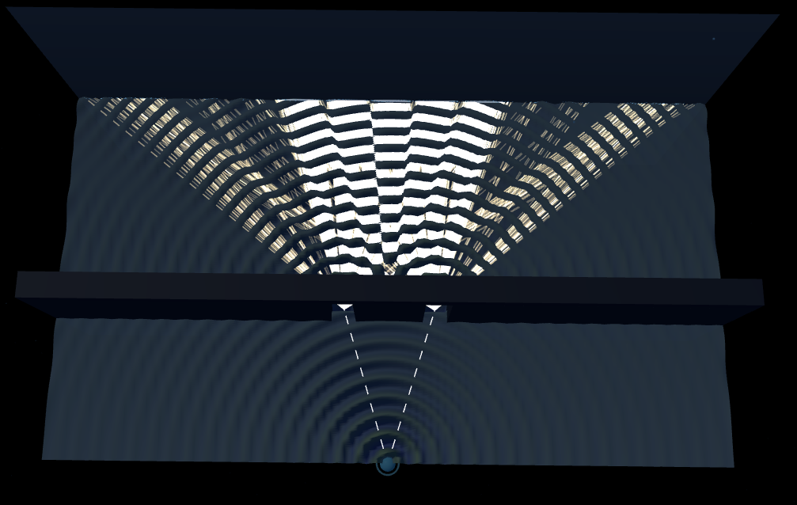
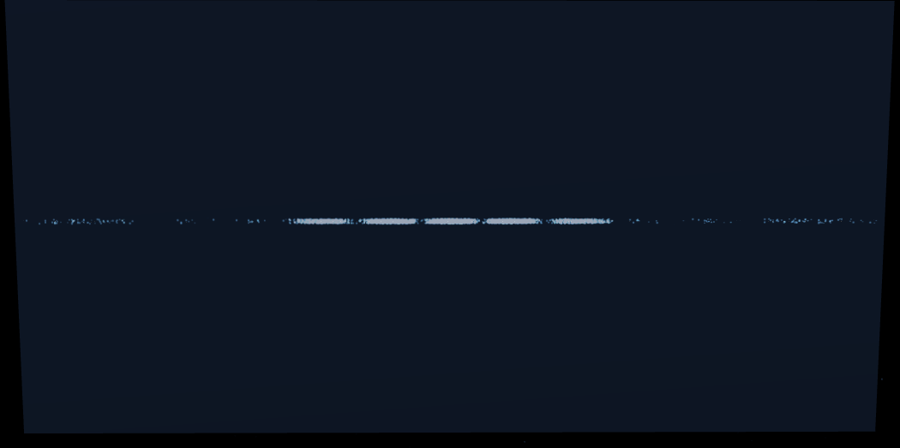
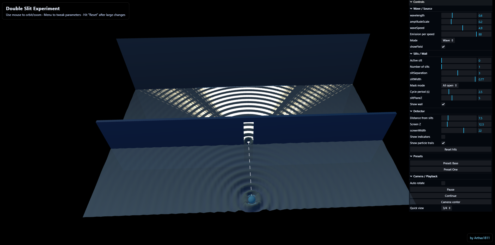
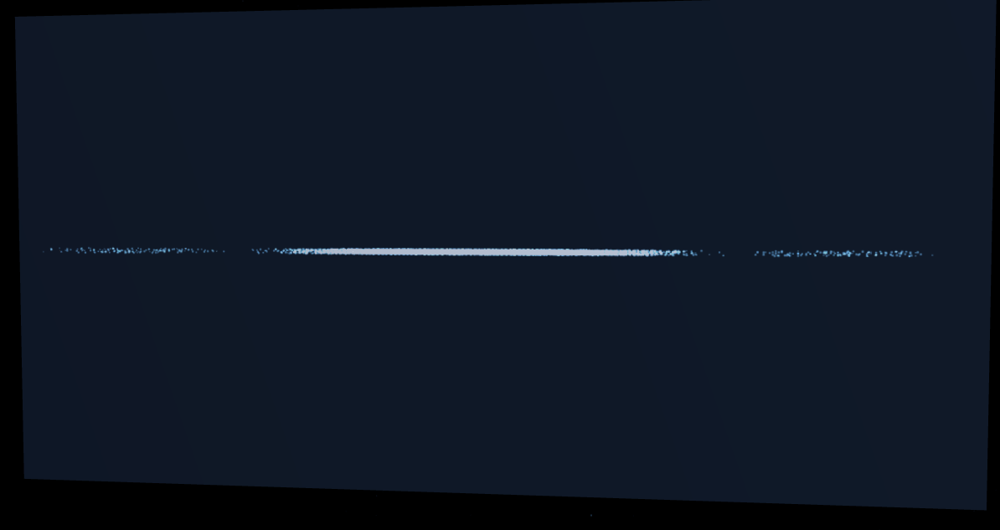
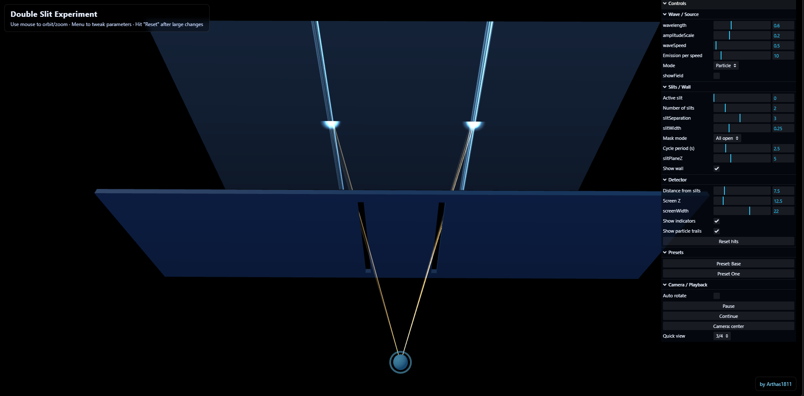

# Double Slit Experiment 3D Simulation

An interactive 3D visualization of the famous double slit experiment from quantum mechanics, built with Three.js. This simulation allows you to explore how light and matter behave under different conditions, demonstrating the fundamental principles of quantum mechanics in an intuitive and visually engaging way.

## Wave vs Particle Behavior

This simulation allows you to compare two fundamentally different physical scenarios:

- **Wave Mode**: Demonstrates the actual double slit experiment with waves. Light or matter waves spread out and interfere with themselves. When two slits are open, waves from both slits overlap and interact, creating an interference pattern with bright and dark bands on the detection screen.

- **Particle Mode**: Shows a classical mechanics comparison—imagine shooting solid balls through the slits instead of waves. Classical particles travel in straight lines and go through one slit or the other (not both). This produces a simple additive pattern without any interference effects.

By comparing these two modes, you can visualize why the quantum double slit experiment is so remarkable: in reality, quantum objects exhibit wave-like behavior, but classical objects would behave like particles.

## Features

- **Interactive 3D Visualization**: Explore the experiment from multiple angles with intuitive camera controls
- **Flexible Configurations**:
  - Single or double slit setups
  - Adjustable slit width and separation
  - Configurable wavelength and observer distance
- **Real-time Parameter Control**: Adjust experiment parameters via interactive GUI menu
- **Customizable Visualization**: Toggle field display, detector markers, and particle trails
- **Multiple Viewing Angles**: Preset camera positions for optimal observation

## Screenshots

### Wave Interference Double Slit

*Classic double slit interference pattern with wave propagation*

### Interference Pattern

*The resulting interference pattern from double slit setup*

### Single Slit Waves

*Diffraction pattern from a single slit*

### Single Slit Interference

*Single slit diffraction effects*

### Classical Particle Trajectories Double Slit

*Classical particles (like balls) traveling through the slits in straight lines*

## Getting Started

### Installation

#### Quick Start (Easiest Method)

1. Clone or download this repository
2. Navigate to the `Double-Slit-Sim` folder
3. Right-click on `index.html` and select "Open with your web browser" (Chrome, Firefox, Safari, or Edge)

That's it! The simulation will load directly in your browser. No installation or programming experience needed.

#### Developer Setup (For Building/Development)

If you want to build the project or have a local development server:

1. Clone or download this repository
2. Navigate to the `Double-Slit-Sim` directory
3. Install dependencies:
   ```bash
   npm install
   ```

4. Build the project:
   ```bash
   npm run build
   ```

5. Start a local server:
   ```bash
   npm start
   ```

6. Open your browser and navigate to `http://localhost:8080`

## How to Use

### Basic Controls

**Mouse Controls:**
- **Left Click + Drag**: Orbit the camera around the experiment
- **Scroll**: Zoom in and out
- **Right Click + Drag**: Pan the view

**Overlay Hint:**
- The hint at the top of the screen indicates: "Use mouse to orbit/zoom · Menu to tweak parameters · Hit 'Reset' after large changes"

### GUI Menu

Click on the menu icon or press the GUI button to open the control panel with the following options:

#### Experiment Parameters
- **Wavelength**: Adjust the wavelength of the waves (affects interference pattern spacing)
- **Slit Separation**: Control the distance between slits
- **Slit Width**: Adjust the physical width of each slit
- **Slit Count**: Choose between 1 or 2 slits
- **Slit Mask Mode**: 
  - `All`: Both slits open simultaneously
  - `Single`: Only one slit open at a time
  - `Cycle`: Automatically cycle between slits

#### Detection & Display
- **Mode**: Toggle between `wave` (wave propagation and interference) and `particle` (classical particle trajectories)
- **Wave Speed**: Control the speed of wave propagation
- **Emission Rate**: Adjust the rate of particle/wave emission
- **Detector Offset**: Distance from slits to detection screen

#### Visualization Options
- **Show Field**: Toggle the visible wave field representation
- **Show Wall**: Toggle the slit barrier visualization
- **Show Indicators**: Toggle detector marking indicators
- **Show Trails**: Toggle particle trajectory trails
- **Auto Rotate**: Automatically rotate the view
- **Paused/Resume**: Pause and resume the simulation

#### Camera & Reset
- **View**: Quick preset camera angles (Three Quarter view recommended)
- **Reset Detections**: Clear all accumulated particle hits
- **Reset Camera**: Return to default camera position

### Tips for Best Results

1. **Start Simple**: Begin with the double slit in wave mode to see the classic interference pattern
2. **Switch Modes**: Toggle between wave and particle modes to observe the quantum mechanical behavior change
3. **Adjust Parameters Slowly**: Large changes may require clicking "Reset" to reinitialize
4. **Observation Distance**: Use the detector offset to see how interference patterns change with distance
5. **Multiple Angles**: Use the camera controls to view the experiment from different perspectives to better understand the 3D geometry

### Experiment Ideas

1. **Observe Wave Interference**: Run in wave mode and watch the interference pattern form
2. **Single vs Double Slit**: Switch slit count to compare diffraction vs interference
3. **Wavelength Effects**: Adjust wavelength to see how pattern spacing changes
4. **Slit Width Impact**: Change slit width to observe how it affects the pattern
5. **Particle by Particle**: Use particle mode with low emission rate to watch individual detections accumulate
6. **Cycling Slits**: Use "Cycle" mode to observe what happens when slits are opened and closed sequentially

## Technical Details

### Built With
- **Three.js**: 3D graphics rendering
- **OrbitControls**: Interactive camera control
- **lil-gui**: Intuitive parameter control interface
- **ESBuild**: Module bundling

### System Requirements
- Modern web browser with WebGL support
- Recommended: 2GB RAM, dedicated graphics card for smooth animation

## Files Structure

```
Double-Slit-Sim/
├── index.html          # Main HTML page
├── main.js             # Core simulation logic
├── bundle.js           # Bundled JavaScript (generated)
├── style.css           # Styling and layout
├── package.json        # Project dependencies
└── vendor/
    ├── three.min.js    # Three.js library (minified)
    ├── three.module.js # Three.js module version
    ├── OrbitControls.js # Camera control system
    └── lil-gui.esm.min.js # GUI library
```

## Interactive Learning

This simulation is ideal for:
- Physics students learning about quantum mechanics and wave-particle duality
- Understanding the famous double slit experiment at a visceral level
- Exploring how observation affects quantum systems
- Visualizing the mathematical principles of interference and diffraction

## Browser Compatibility

- Chrome/Chromium (recommended for best performance)
- Firefox
- Safari
- Edge

## License

ISC

## Notes

- Hit "Reset" after making large parameter changes to reinitialize the simulation
- The simulation runs in real-time; particle accumulation may take time depending on emission rate
- For best performance, disable particle trails if running on lower-end hardware
- Camera position is saved when changed and will persist across sections

---

**Enjoy exploring one of quantum mechanics' most fascinating phenomena!**
