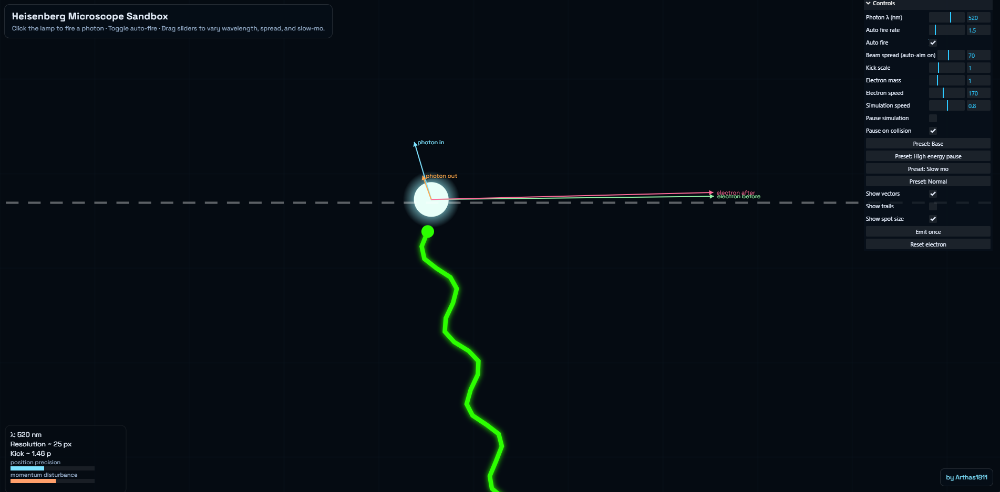
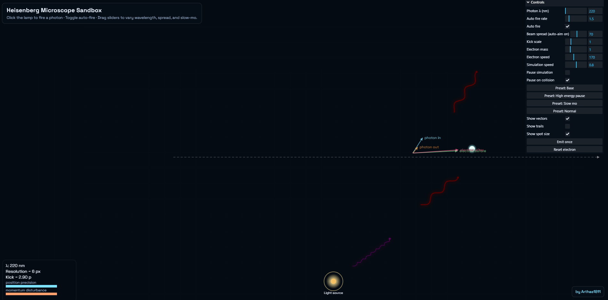

# Heisenberg-Sim

Interactive browser demos for two cornerstone quantum experiments. Everything runs locally in your browser; a tiny Node toolchain is only needed if you want to rebuild the bundled JavaScript files.





## Get the project

Choose either path:

- **Download ZIP (no Git needed):**
  1. Click Code -> Download ZIP on GitHub.
  2. Unzip it.
  3. Open the unzipped `Heisenberg-Sim` folder.

- **Clone (developer-friendly):**
  ```bash
  git clone https://github.com/Arthas1811/Heisenberg-Sim.git
  cd Heisenberg-Sim
  ```

Then pick a simulation below.

## Project layout

- [Double-Slit-Sim](https://github.com/Arthas1811/Heisenberg-Sim/tree/main/Double-Slit-Sim) - 3D double/triple slit visualizer built with Three.js.
- [Heisenbergs-Microscope](https://github.com/Arthas1811/Heisenberg-Sim/tree/main/Heisenbergs-Microscope) - 2D Heisenberg microscope sandbox.
- `Screenshots/` - images used above and inside the sub-readmes.

## Install & Run

### Double-Slit-Sim (3D)
Folder: `Double-Slit-Sim/`  
GitHub: https://github.com/Arthas1811/Heisenberg-Sim/tree/main/Double-Slit-Sim

- Quick start (no tools): open `Double-Slit-Sim/index.html` in a modern browser.
- Developer setup (Node.js + npm):
  1. `cd Double-Slit-Sim` (or `cd Heisenberg-Sim/Double-Slit-Sim` after clone)
  2. `npm install`
  3. `npm run build` (regenerate `bundle.js` after code changes)
  4. `npm start` (launches `http-server`, default http://localhost:8080)

### Heisenbergs-Microscope (2D)
Folder: `Heisenbergs-Microscope/`  
GitHub: https://github.com/Arthas1811/Heisenberg-Sim/tree/main/Heisenbergs-Microscope

- Quick start (no tools): open `Heisenbergs-Microscope/index.html` in your browser. For reliable asset loading, prefer the server step below.
- Developer setup (Node.js + npm):
  1. `cd Heisenbergs-Microscope` (or `cd Heisenberg-Sim/Heisenbergs-Microscope` after clone)
  2. `npm install`
  3. `npm run build` (regenerate `bundle.js` after code changes)
  4. `npx http-server -c-1 .` (or add `npm start` alias) and open http://localhost:8080

## Notes

- Both projects bundle dependencies locally (see `vendor/`), so no CDN is required at runtime.
- You only need Node.js and npm for the build/server commands; viewing `index.html` directly works for quick demos.
- If you edit code, rerun the respective `npm run build` so `bundle.js` matches your changes.
